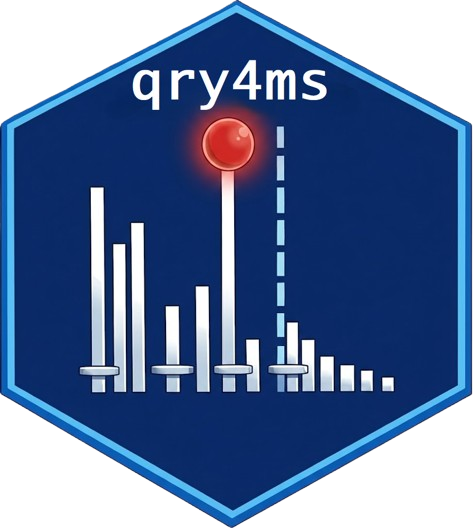

[](https://www.repostatus.org/#inactive)
[](https://cran.r-project.org/index.html)
[](https://choosealicense.com/licenses/gpl-3.0/)
# qry4ms 

### Description :bookmark_tabs:
The [`Shiny App`](https://shiny.posit.co/) for making an MS query: 
- Generates an individual .ms or .mgf file from user-provided MS spectra in MS1 & MS2 levels for a single compound. Spectra can be provided in .txt or pasted directly from the clipboard.
- Generated .ms / .mgf files were tested as inputs in [`SIRIUS`](https://bio.informatik.uni-jena.de/software/sirius/), and [`NIST MS Search`](https://chemdata.nist.gov/mass-spc/ms-search/).
- Filters by precursor mass and relative abundance, which provides a tidy formatting for the search query in MS fragmentation libraries.
- Static/Interactive MS1 & MS2 spectra.
- Builds a mirror plot from the reference spectra, and calculates similarity and matched peaks based on [`MsCoreUtils`](https://bioconductor.org/packages/release/bioc/html/MsCoreUtils.html).
- Computes Isotopic Pattern Distribution and Monoisotopic Mass for chemical formula based on [`envipat`](https://cran.r-project.org/web/packages/enviPat/index.html).
- Calculates Adducts Map based on [`MetaboCoreUtils`](https://www.bioconductor.org/packages/release/bioc/html/MetaboCoreUtils.html).
- Generates Molecular Formula based on [`Rdisop`](https://bioconductor.org/packages/release/bioc/html/Rdisop.html) by accurate mass or isotopic pattern.
- Interprets MS1 spectra based on [`InterpretMSSpectrum`](https://cran.r-project.org/web/packages/InterpretMSSpectrum/index.html).
- Calculates Mass Error.

### Launch the App :rocket:
**Shiny deployment**<br>
[**`https://plyush1993.shinyapps.io/qry4ms/`**](https://plyush1993.shinyapps.io/qry4ms/) <br><br>
**Run locally**<br>
Install:
```r
if (!require("BiocManager", quietly = TRUE)) {
    install.packages("BiocManager")
}
if (!require("remotes", quietly = TRUE)) {
    install.packages("remotes")
}
remotes::install_github("plyush1993/qry4ms", INSTALL_opts = "--no-multiarch")
```
or
```r
if (!requireNamespace("pak", quietly = TRUE)) install.packages("pak")
pak::pak("plyush1993/qry4ms")
```
Run:
```r
qry4ms::run_qry4ms()
```
<br>

> [!IMPORTANT]
>The [App's script](https://github.com/plyush1993/qry4ms/blob/main/app.R) was compiled using [R version 4.1.2](https://cran.r-project.org/bin/windows/base/old/4.1.2/) 
<br>

### Contact :mailbox_with_mail:
Please send any comment, suggestion or question you may have to the author (Dr. Ivan Plyushchenko):  
<div> 
  <a href="mailto:plyushchenko.ivan@gmail.com"></a>
  <a href="https://github.com/plyush1993"></a>
  <a href="https://orcid.org/0000-0003-3883-4695"></a>
</div>
